| Nama      | Nuryadi |
| ----------- | ----------- |
| NIM     | 312010621       |
| Kelas   | TI.20.A.1        |

## Langkah langkah praktikum
Membuka text editor, Saya menggunakan Sublime text
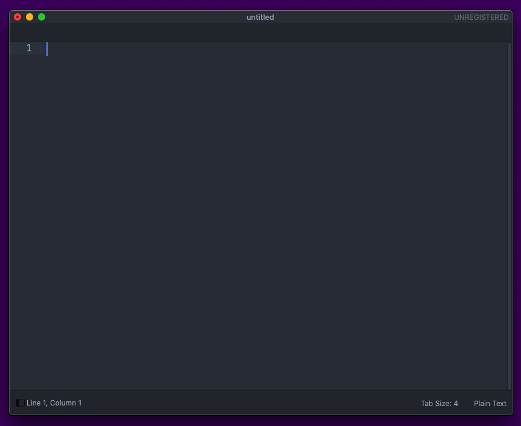

## 1. Membuat Paragraf 
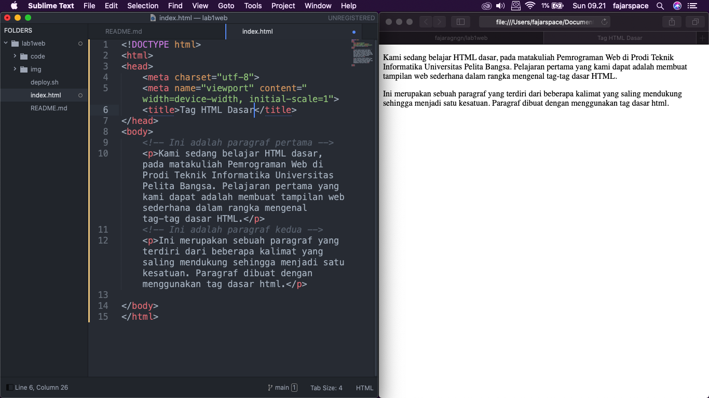

## 2. Menambahkan Judul
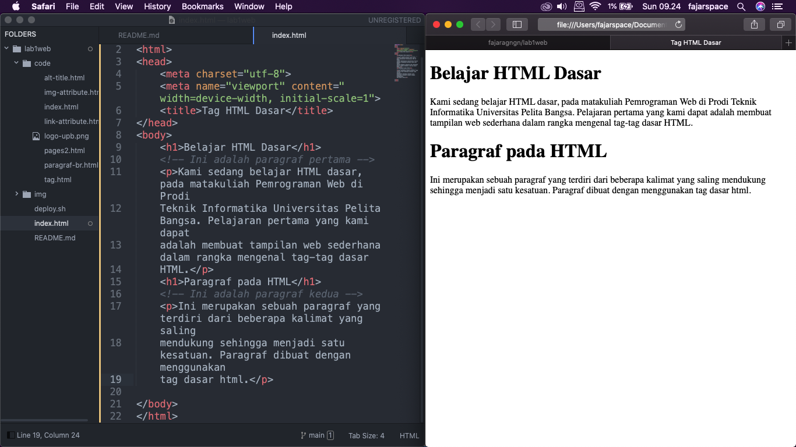

## 3. Memformat Text
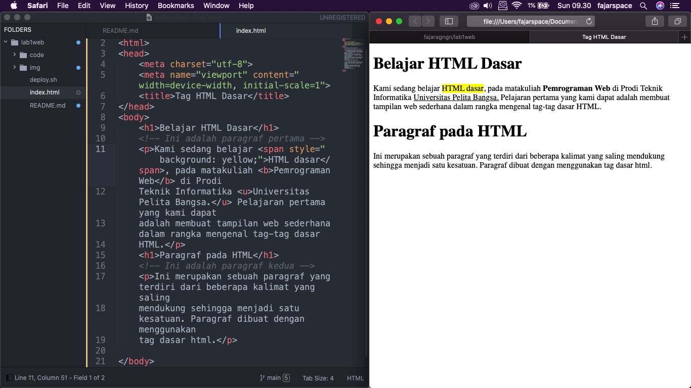

## 4. Menyisipkan Gambar
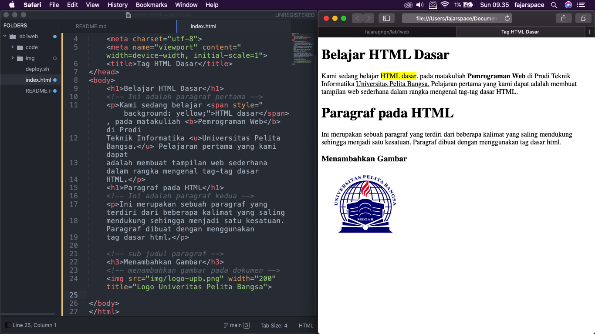

## 5. Menambahkan Hyperlink
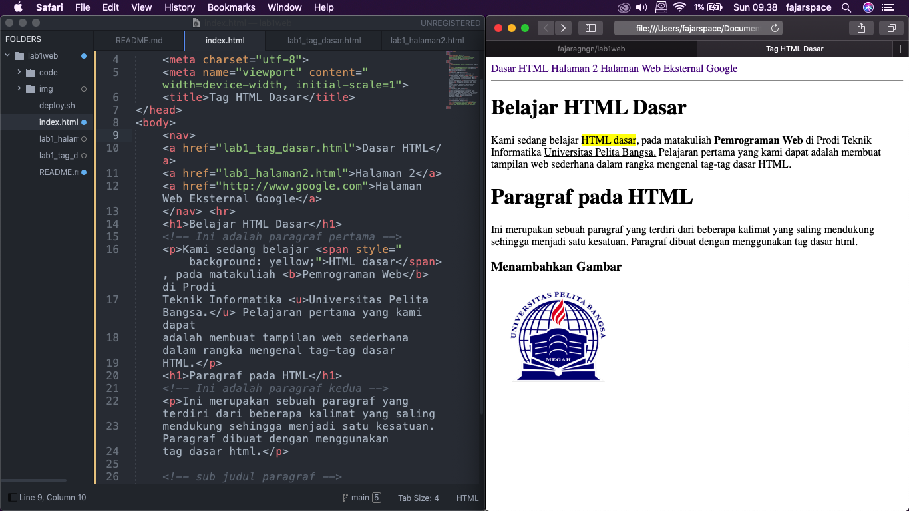
Lalu berikutnya halaman 2
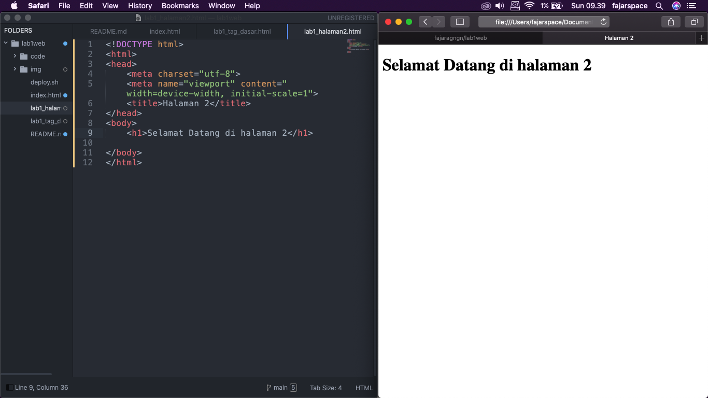

## Jawab Pertanyaan Berikut
1. Lakukan perubahan pada kode sesuai dengan keinginan anda, amati perubahannya adakah
error ketika terjadi kesalahan penulisan tag?
2. Apa perbedaan dari tag `
` dengan tag ` `, berikan penjelasannya! 
3. Apa perbedaan atribut title dan alt pada tag ``, berikan penjelasannya!
4. Untuk mengatur ukuran gambar, digunakan atribut width dan height. Agar tampilan gambar
proporsional sebaiknya kedua atribut tersebut diisi semua atau tidak? Berikan penjelasannya!
5. Pada link tambahkan atribut target dengan nilai atribut bervariasi ( _blank, _self, _top,
_parent ), apa yang terjadi pada masing-masing nilai antribut tersebut?

## Jawab
1. Saya akan melakukan perubahan pada tag html, gambar dibawah merupakan syntax HTML sebelum saya rubah
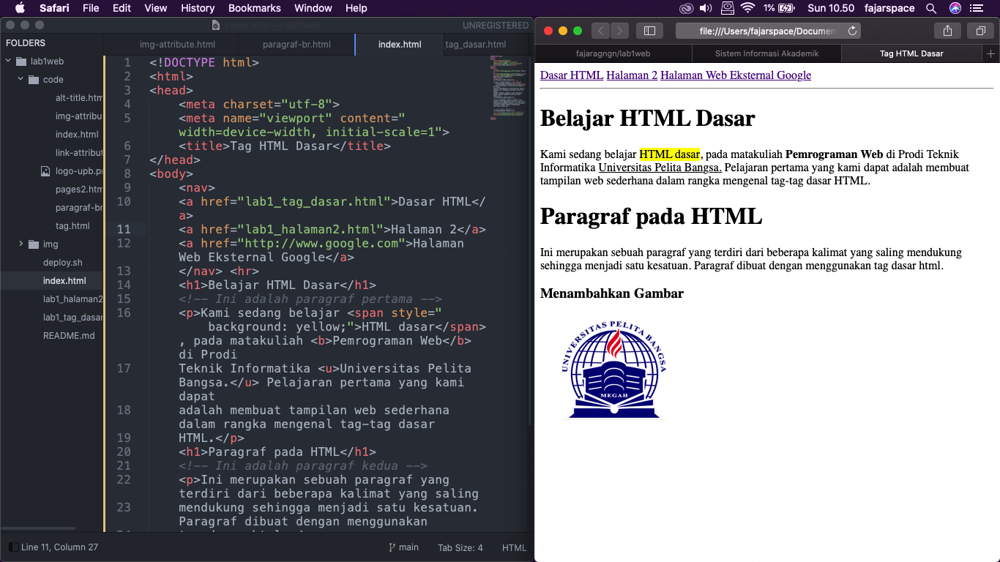
Lalu ketika saya hilangkan akhiran pada Tag `</h1>`menjadi `<h1>`, maka yang akan terjadi seluruh elemen dibawah tag tersebut akan berubah mengikuti Tag `<h1>` dikarenakan tidak ada akhiran/penutup Tag tersebut. 
Seperti gambar dibawah
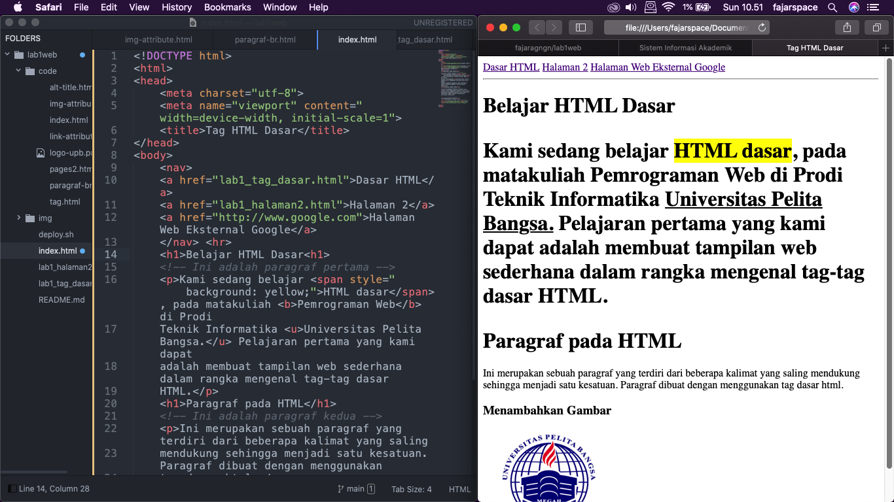

2. Tag `
` berfungsi untuk memberi perintah paragraf pada halaman html

	Tag ` ` berfungsi untuk memberikan perintah breakline atau baris baru
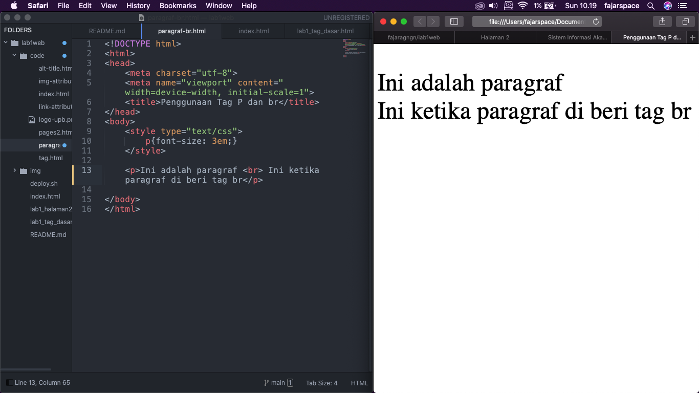

3. `title` berfungsi untuk memberikan judul pada gambar

	`alt` berfungsi untuk menunjukkan sebuah alternate text (teks pengganti) yang akan muncul apabila gambar tidak dapat ditampilkan.

	gambar dibawah ini menunjukan perbedaan title dan alt, dimana pada bagian alt terdapat judul gambar saat tidak bisa ditampilkan
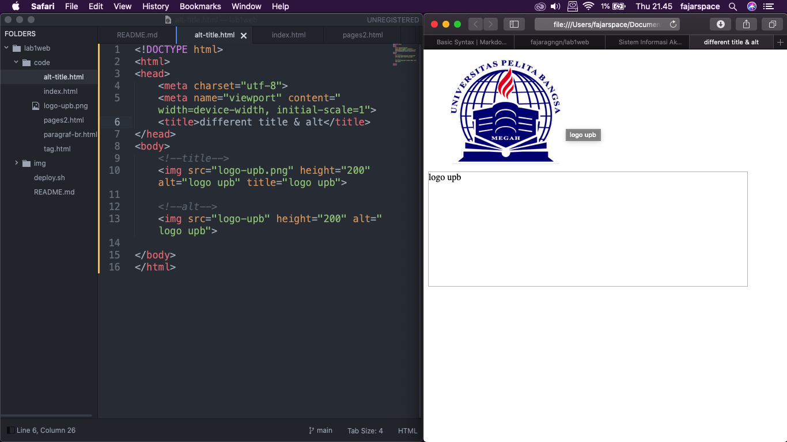

4. Menurut saya Kedua property ini sangat penting dan merupakan bagian yang tidak terpisahkan dari sebuah website karena masing-masing Tag atau Element pada sebuah HTML perlu memiliki ukuran yang ideal, sebab itu berpengaruh dalam pengaturan tataletak dan tampilan sebuah website,

	Kecuali pada kondisi tertentu seperti gambar sudah memiliki ukuran yang pas/proporsional cukup mengatur width nya saja
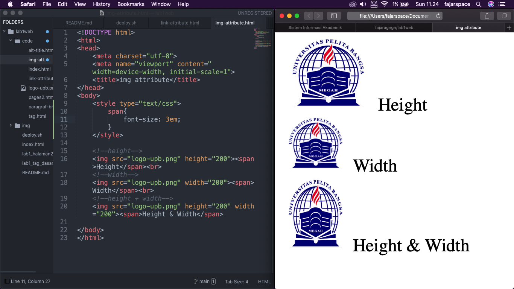

5. `_blank` untuk membuka link di tab baru

	`_self` untuk membuka link di frame link itu berada

	`_top` untuk membuka link di frame paling atas (paling luar).  contohnya jika di website(1) di dalamnya ada website(2) lalu di website(2) di dalamnya ada website (3) lalu di website (3) ini ada link dan kita klik, maka link akan terbuka di website(1)

	`_parent` untuk membuka link di frame yang satu tingkat di atas frame link tersebut berada. contohnya jika di website(1) di dalamnya ada website(2) lalu di website(2) ini ada link dan kita klik, maka link akan terbuka di website(1)
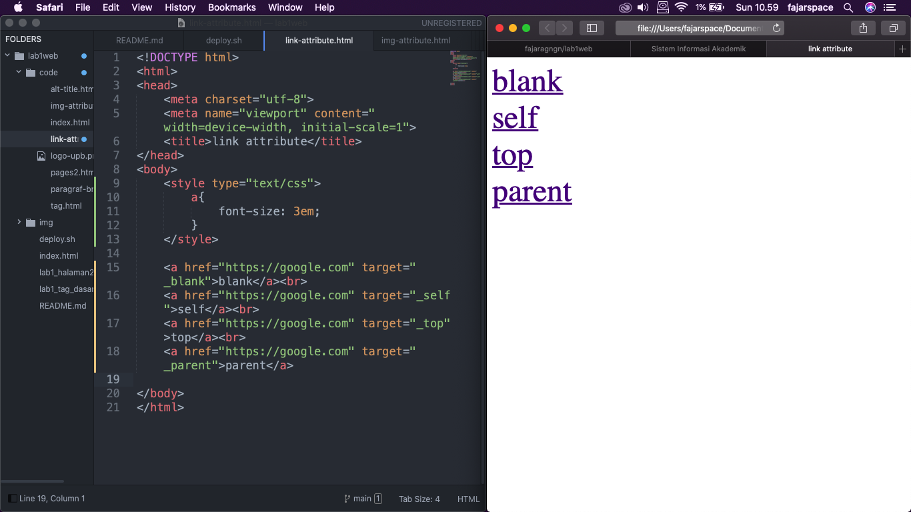